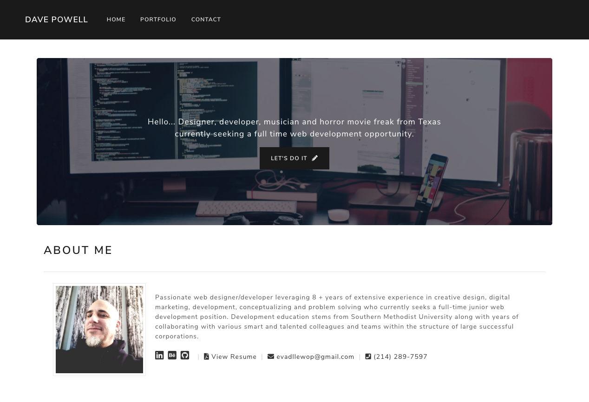

# React Portfolio

## Description
A Bootstrap portfolio built with React

## Requirements

* Updated portfolio featuring 6 total projects

* Use React

* A `Header` component that appears on multiple pages

* A single `Project` component that will be used multiple times on a single page 

* Navigation with React Router, dynamic rendering, or another third part router

* A `Footer` component that appears on multiple pages

* Update GitHub profile with pinned repositories featuring those same projects

  ## Table of Contents
  * [Screenshot](#screenshot)
  * [Technologies](#technologies)
  * [Project URLs](#urls)
  * [Author](#author)

  ## Screenshot
  

   ## Technologies
  * HTML
  * CSS
  * Bootstrap
  * React
  * Javascript
  * Heroku

  ## URLs
  * Deployed App:
    https://evadllewop.github.io/EmployeeDirectory/

  * Github Repo:
    https://github.com/evadllewop/ReactPortfolio
 

  ## Author

  Dave Powell

  * [Github Profile](https://github.com/evadllewop)

